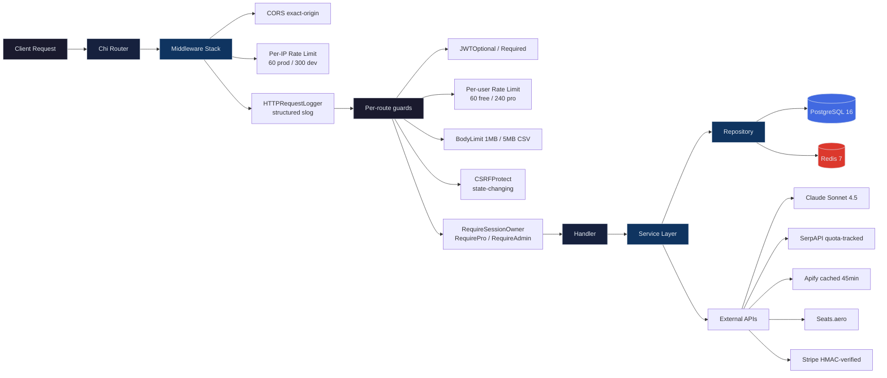

<div align="center">


# MapleRewards

**The first Canadian-native credit card rewards optimization platform.**

Canada's $820B+ credit card market has zero native rewards optimization tools. Every existing platform is US-focused, leaving Canadian cardholders guessing which card to pull out at checkout. MapleRewards fixes that.

`104 cards` | `27 loyalty programs` | `80+ API endpoints` | `43 migrations` | Production-ready

</div>

---

## What It Does

MapleRewards tells you which credit card earns the most on every purchase, tracks your points across every Canadian loyalty program, and finds award flights — all backed by a conversational AI assistant that knows your entire wallet.

| Feature | Description |
|---|---|
| **Rewards Optimizer** | Input a spending amount and category. Get a ranked list of cards sorted by effective return percentage. |
| **Card Wallet** | Track owned cards and point balances across 19 Canadian loyalty programs with transfer partner networks. |
| **Trip Planner** | Google Flights search integrated with award availability across 15+ airline booking portals. |
| **AI Chat Assistant** | Claude Sonnet 4.5 with full wallet context injection — answers "which card should I use?" with your actual data. |
| **Portfolio Analysis** | Annual value breakdown per card, fee ROI calculations, and dollar gap analysis against optimal alternatives. |
| **Welcome Bonus Tracker** | Progress bars and activation milestones for minimum spend requirements on new cards. |
| **Card Comparison** | Side-by-side comparison of any catalogued cards across all earning categories and perks. |
| **Spending Tracker** | Transaction logging with category-based statistics and historical trends. |
| **Multi-step Onboarding** | Card selection flow and spending category profiling to personalize recommendations from day one. |
| **Application Tracker** | Records every card application with per-issuer cooldown rules (RBC 90d, TD 365d, BMO 90d, etc.) and warns before re-applying inside the cooldown window. |
| **Missed-Rewards Weekly Digest** | Pro-only email: replays last 7 days of swipes through the optimizer and surfaces every transaction where a different wallet card would have earned more. Empty weeks aren't sent. |
| **Affiliate-Aware Apply CTAs** | One-click apply buttons on `/cards/[id]`, `/compare/[a]/[b]`, and optimizer results — routed through a click-logging redirect endpoint that powers per-card affiliate attribution. |

---

## Architecture



The backend follows a strict **Handler > Service > Repository** separation. Handlers extract and validate request parameters. Services contain all business logic. Repositories own database access. No layer skips another.

A standalone worker (`cmd/worker`) handles long-running background sweeps (award-watch alerts, issuer-page-diff detection) so the API stays responsive. A second standalone binary (`cmd/refresh-valuations`) re-anchors CPP freshness weekly via cron.

---

## Tech Stack

| Layer | Technology |
|---|---|
| **Backend** | Go 1.23, Chi v5 router, structured slog, expvar metrics |
| **Frontend** | Next.js 16 (App Router), React 19, TypeScript, Tailwind CSS 4, Framer Motion 12, shadcn/ui |
| **Database** | PostgreSQL 16 (20+ tables, 43 migrations) |
| **Cache** | Redis 7 (wallet 30m, valuations 1h invalidatable, award search 45m, monthly provider quota counters) |
| **AI** | Claude Sonnet 4.5 with tool-use loop (9 tools), DB-backed conversation history, wallet-aware prompt assembly |
| **Payments** | Stripe (HMAC-verified webhook, idempotent event dedup, monthly + annual + lifetime tiers) |
| **Auth** | Google OAuth + JWT (HS256, refresh rotation with reuse-detection, CSRF double-submit) |
| **External Data** | SerpAPI (cash + economy baseline + round-trip, quota-tracked), Apify (award scraping, 45m Redis cache), Seats.aero (award availability), Tavily (web search fallback) |
| **Ops** | Docker non-root user 10001, govulncheck + npm audit in CI, /admin/metrics + /admin/quota + /admin/valuations |

---

## Getting Started

### Prerequisites

- Go 1.23+
- Node.js 20+
- Docker & Docker Compose

### Setup

```bash
# Start PostgreSQL + Redis and run all migrations
make setup

# Start the Go backend on :8080
make dev

# In a separate terminal — start the background worker
# (award-watch sweeps, issuer-watch, missed-rewards digest, promo sentinel)
make worker

# In a third terminal — start Next.js on :3000
cd frontend && npm run dev
```

### Environment Variables

Create a `.env` file in the project root with the following:

| Variable | Purpose |
|---|---|
| `DATABASE_URL` | PostgreSQL connection string |
| `REDIS_ADDR` | Redis host and port |
| `REDIS_PASSWORD` | Redis authentication |
| `PORT` | Backend server port |
| `CORS_ORIGIN` | Allowed frontend origin |
| `JWT_SECRET` | Token signing key |
| `ANTHROPIC_API_KEY` | Claude API access |
| `TAVILY_API_KEY` | Web search for AI assistant |
| `SERPAPI_KEY` | Google Flights data |
| `APIFY_TOKEN` | Award availability scraping |
| `SEATSAERO_API_KEY` | Seats.aero award search |
| `RESEND_API_KEY` | Optional — outbound email (digests, alerts). Stub logger used when unset. |
| `VAPID_PUBLIC_KEY` / `VAPID_PRIVATE_KEY` | Optional — Web Push delivery for award-watch alerts. |
| `TRUSTED_PROXIES` | Comma-separated CIDRs whose `X-Forwarded-For` headers are honored by the rate limiter. Empty for direct-to-internet. |
| `DB_MAX_CONNS` / `DB_MIN_CONNS` | Postgres pool sizing (defaults 25 / 2). Override per environment. |
| `STRIPE_SECRET_KEY` / `STRIPE_WEBHOOK_SECRET` | Pro-tier billing. |

---

## Data Model

20+ PostgreSQL tables across 43 migrations. Core entities:

```
users + auth_users + email_verifications + refresh_tokens   Auth + JWT rotation + email verification
loyalty_programs ........... 19 Canadian programs (Aeroplan, Avion, Scene+, PC Optimum, ...)
cards + card_multipliers ... 104 credit cards with per-category earn rates
categories ................. 8 spending categories with MCC mappings
transfer_partners .......... Program-to-airline/hotel transfer ratios
point_valuations + history . CPP benchmarks; weekly refresh re-anchors freshness
user_cards + spend_entries . Wallet + transaction log
welcome_bonus + bonuses .... Sign-up bonus tracking and milestone progress
card_credits + redemptions . Annual credit / renewal tracker
sqc_accrual + thresholds ... Aeroplan 2026 Status-Qualifying Credits projector
award_watch + events ....... Pro-tier saved trips; worker re-probes on a 4h tick
buy_promo_pricing .......... Buy-points break-even calculator
devaluation_events ......... Chart-change history (June 2026 Aeroplan, etc.)
merchant_acceptance ........ Stack-calculator merchant catalog
issuer_page_diff ........... Bank product-page change detector
loyalty_accounts ........... Non-card program tracking (Marriott, Hyatt, etc.)
card_offers ................ Amex Offers / RBC Offers / Scene+ tracker
chat_conversations + msgs .. Server-side AI chat history
stripe_customer + events ... Stripe billing + idempotent webhook dedup
affiliate_links + clicks ... Per-card affiliate URLs + click ledger
card_applications .......... User-recorded card applications + status
issuer_rules ............... Per-issuer cooldown rules (RBC 90d, TD 365d, etc.)
push_subscriptions ......... Web Push (VAPID) endpoints per user
transfer_bonus_events ...... Promo Sentinel: live-detected transfer bonuses
```

**Spending Categories**: Groceries, Dining, Travel, Gas, Pharmacy, Entertainment, Streaming, Everything Else

---

<details>
<summary><strong>Project Structure</strong></summary>

```
maplerewards-main/
├── cmd/
│   ├── api/main.go              # API entry point (~550 LOC; routes + middleware + DI)
│   ├── worker/                  # Background sweeps (award-watch, issuer-watch)
│   └── refresh-valuations/      # Weekly cron — re-anchors point_valuations freshness
├── internal/
│   ├── handler/                 # 37 HTTP handlers — masked errors via jsonMaskedError
│   ├── service/                 # 40 business-logic files
│   │   ├── ai.go               # Claude tool-use loop + wallet context (~1,100 LOC)
│   │   ├── trip.go             # Trip planner (~1,100 LOC; Apify-priming aware)
│   │   ├── award_search.go     # Live award + economy-baseline (~760 LOC)
│   │   └── optimizer.go        # Card ranking (305 LOC)
│   ├── repo/                    # 20 pgx-backed repositories
│   ├── model/types.go           # Shared DTOs
│   ├── middleware/              # JWT, CSRF, ratelimit (token bucket), bodylimit,
│   │                            # session_owner, RequireAdmin, RequirePro, HTTPRequestLogger
│   ├── cache/                   # Redis (wallet, valuations, award search, multipliers)
│   ├── quota/                   # Monthly INCR counter for SerpAPI / Apify / Tavily
│   ├── metrics/                 # expvar-backed counters surfaced at /admin/metrics
│   ├── health/                  # Apify smoke check (6h)
│   └── knowledge/               # YAML knowledge bases (rewards + strategies)
├── frontend/                    # Next.js 16 app
│   ├── app/                     # 22 page routes (incl. pro-tools, trip-planner)
│   ├── components/
│   │   ├── editorial/          # PaperTile + EmptyState (unified empty-state primitive)
│   │   ├── pro-tools/          # 14 extracted Pro Tools tiles + PersonalStrip
│   │   └── trip-planner/       # SourceBadge, SegmentDetails, WalletAffordPill, LoadingPills
│   └── contexts/                # Session, Auth, Wallet, Sidebar
├── migrations/                  # 34 PostgreSQL migrations (matched up/down pairs)
├── docs/
│   └── DEPLOY.md                # Production runbook
├── BRAND.md                     # Brand voice + banned-word list + palette
├── SECURITY.md                  # Threat model + defense layers
├── SHIP.md                      # Single-page deployment checklist
├── Dockerfile                   # Multi-stage; runs as USER 10001:10001
├── Makefile                     # Build & run commands
└── docker-compose.yml           # Local PostgreSQL + Redis
```

</details>

<details>
<summary><strong>Codebase Breakdown</strong></summary>

| Component | Lines | Language |
|---|---|---|
| Backend services | 10,717 | Go |
| Frontend application | 17,043 | TypeScript |
| **Total** | **27,760** | |

Largest backend files by complexity:

| File | Lines | Responsibility |
|---|---|---|
| `service/trip.go` | 1,040 | Trip planning, flight search orchestration, award link generation |
| `service/ai.go` | 1,026 | Claude integration, wallet context building, streaming responses |
| `service/award_search.go` | 698 | Multi-source award availability aggregation |
| `model/types.go` | 600+ | Domain models, API request/response types |
| `service/optimizer.go` | 305 | Card ranking algorithm, effective return calculation |

</details>

---

## Testing

```bash
# Run Go tests with race condition detection
make test

# Run Go linter
make lint

# Run frontend linting
cd frontend && npm run lint
```

---

## Production Operations

| Concern | Where |
|---|---|
| Deploy runbook | [`SHIP.md`](SHIP.md) — 10 ordered steps from infra to smoke |
| Threat model + defense layers | [`SECURITY.md`](SECURITY.md) |
| Brand voice / banned-word list | [`BRAND.md`](BRAND.md) |
| Detailed env vars + topology | [`docs/DEPLOY.md`](docs/DEPLOY.md) |
| In-process metrics | `GET /api/v1/admin/metrics` (admin-gated) |
| External API quota dashboard | `GET /api/v1/admin/quota` (admin-gated) |
| Push fresh CPP values | `POST /api/v1/admin/valuations` (admin-gated) |
| CI gates | `go vet`, `golangci-lint`, `go test -race`, `govulncheck`, `next build`, `npm audit`, Docker non-root verification |

## How the Optimizer Works

The core ranking algorithm in `optimizer.go` takes a spending amount and category, then:

1. Looks up every card's earn rate for that category (including base rates and multipliers)
2. Resolves the loyalty program each card earns into
3. Applies cents-per-point valuations to convert points to dollar values
4. Factors in annual fee amortization for cards with fees
5. Returns a ranked list sorted by effective return percentage

This runs against all 92 catalogued cards in under 50ms.

---

## Built With

[](https://go.dev)
[](https://nextjs.org)
[](https://react.dev)
[](https://www.typescriptlang.org)
[](https://www.postgresql.org)
[](https://redis.io)
[](https://tailwindcss.com)
[](https://www.framer.com/motion)
[](https://www.anthropic.com)
[](https://stripe.com)

---

## License

MIT License. See [LICENSE](LICENSE) for details.
