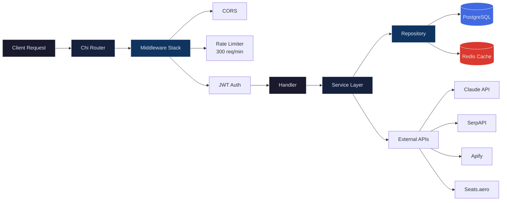

<div align="center">


# MapleRewards

**The first Canadian-native credit card rewards optimization platform.**

Canada's $820B+ credit card market has zero native rewards optimization tools. Every existing platform is US-focused, leaving Canadian cardholders guessing which card to pull out at checkout. MapleRewards fixes that.

`92 cards` | `19 loyalty programs` | `35+ API endpoints` | `27,760 lines of code`

</div>

---

## What It Does

MapleRewards tells you which credit card earns the most on every purchase, tracks your points across every Canadian loyalty program, and finds award flights — all backed by a conversational AI assistant that knows your entire wallet.

| Feature | Description |
|---|---|
| **Rewards Optimizer** | Input a spending amount and category. Get a ranked list of cards sorted by effective return percentage. |
| **Card Wallet** | Track owned cards and point balances across 19 Canadian loyalty programs with transfer partner networks. |
| **Trip Planner** | Google Flights search integrated with award availability across 15+ airline booking portals. |
| **AI Chat Assistant** | Claude Sonnet 4.5 with full wallet context injection — answers "which card should I use?" with your actual data. |
| **Portfolio Analysis** | Annual value breakdown per card, fee ROI calculations, and dollar gap analysis against optimal alternatives. |
| **Welcome Bonus Tracker** | Progress bars and activation milestones for minimum spend requirements on new cards. |
| **Card Comparison** | Side-by-side comparison of any catalogued cards across all earning categories and perks. |
| **Spending Tracker** | Transaction logging with category-based statistics and historical trends. |
| **Multi-step Onboarding** | Card selection flow and spending category profiling to personalize recommendations from day one. |

---

## Architecture



The backend follows a strict **Handler > Service > Repository** separation. Handlers extract and validate request parameters. Services contain all business logic. Repositories own database access. No layer skips another.

---

## Tech Stack

| Layer | Technology |
|---|---|
| **Backend** | Go 1.23, Chi v5 router, JWT authentication |
| **Frontend** | Next.js 16 (App Router), React 19, TypeScript, Tailwind CSS 4, Framer Motion 12, shadcn/ui |
| **Database** | PostgreSQL 16 (12 tables, 9 migrations) |
| **Cache** | Redis 7 |
| **AI** | Claude Sonnet 4.5 (conversational rewards advice with wallet context) |
| **Payments** | Stripe |
| **Auth** | Google OAuth + JWT refresh tokens |
| **External Data** | SerpAPI (flights), Apify (award scraping), Seats.aero (award availability) |

---

## Getting Started

### Prerequisites

- Go 1.23+
- Node.js 20+
- Docker & Docker Compose

### Setup

```bash
# Start PostgreSQL + Redis and run all migrations
make setup

# Start the Go backend on :8080
make dev

# In a separate terminal — start Next.js on :3000
cd frontend && npm run dev
```

### Environment Variables

Create a `.env` file in the project root with the following:

| Variable | Purpose |
|---|---|
| `DATABASE_URL` | PostgreSQL connection string |
| `REDIS_ADDR` | Redis host and port |
| `REDIS_PASSWORD` | Redis authentication |
| `PORT` | Backend server port |
| `CORS_ORIGIN` | Allowed frontend origin |
| `JWT_SECRET` | Token signing key |
| `ANTHROPIC_API_KEY` | Claude API access |
| `TAVILY_API_KEY` | Web search for AI assistant |
| `SERPAPI_KEY` | Google Flights data |
| `APIFY_TOKEN` | Award availability scraping |
| `SEATSAERO_API_KEY` | Seats.aero award search |

---

## Data Model

12 PostgreSQL tables across 9 migrations:

```
users
loyalty_programs ............ 19 Canadian programs (Aeroplan, Avion, Scene+, etc.)
cards ....................... 92 credit cards with reward structures
card_multipliers ............ Per-category earn rates for each card
categories .................. 8 spending categories with MCC code mappings
transfer_partners ........... Program-to-airline/hotel transfer ratios
point_valuations ............ Cents-per-point benchmarks by program
user_cards .................. User wallet — owned cards and balances
spend_entries ............... Transaction log
welcome_bonus ............... Sign-up bonus tracking and progress
stripe_customer ............. Billing integration
refresh_tokens .............. JWT token rotation
```

**Spending Categories**: Groceries, Dining, Travel, Gas, Pharmacy, Entertainment, Streaming, Everything Else

---

<details>
<summary><strong>Project Structure</strong></summary>

```
maplerewards-main/
├── cmd/api/main.go              # Backend entry point
├── internal/
│   ├── handler/                 # 22 HTTP handlers
│   ├── service/                 # 18 business logic files
│   │   ├── ai.go               # Claude integration (1,026 lines)
│   │   ├── trip.go             # Trip planner (1,040 lines)
│   │   ├── award_search.go     # Flight awards (698 lines)
│   │   └── optimizer.go        # Card ranking (305 lines)
│   ├── repo/                    # 7 database access layers
│   ├── model/types.go           # 100+ struct definitions
│   ├── middleware/              # JWT, rate limiting, CORS, logging
│   ├── cache/                   # Redis integration
│   └── knowledge/               # YAML knowledge bases
├── frontend/                    # Next.js 16 app
│   ├── app/                     # 18+ page routes
│   ├── components/              # UI + feature components
│   └── contexts/                # Session, Auth, Wallet, Sidebar
├── migrations/                  # 9 PostgreSQL migrations
├── Makefile                     # Build & run commands
└── docker-compose.yml           # PostgreSQL + Redis
```

</details>

<details>
<summary><strong>Codebase Breakdown</strong></summary>

| Component | Lines | Language |
|---|---|---|
| Backend services | 10,717 | Go |
| Frontend application | 17,043 | TypeScript |
| **Total** | **27,760** | |

Largest backend files by complexity:

| File | Lines | Responsibility |
|---|---|---|
| `service/trip.go` | 1,040 | Trip planning, flight search orchestration, award link generation |
| `service/ai.go` | 1,026 | Claude integration, wallet context building, streaming responses |
| `service/award_search.go` | 698 | Multi-source award availability aggregation |
| `model/types.go` | 600+ | Domain models, API request/response types |
| `service/optimizer.go` | 305 | Card ranking algorithm, effective return calculation |

</details>

---

## Testing

```bash
# Run Go tests with race condition detection
make test

# Run Go linter
make lint

# Run frontend linting
cd frontend && npm run lint
```

---

## How the Optimizer Works

The core ranking algorithm in `optimizer.go` takes a spending amount and category, then:

1. Looks up every card's earn rate for that category (including base rates and multipliers)
2. Resolves the loyalty program each card earns into
3. Applies cents-per-point valuations to convert points to dollar values
4. Factors in annual fee amortization for cards with fees
5. Returns a ranked list sorted by effective return percentage

This runs against all 92 catalogued cards in under 50ms.

---

## Built With

[](https://go.dev)
[](https://nextjs.org)
[](https://react.dev)
[](https://www.typescriptlang.org)
[](https://www.postgresql.org)
[](https://redis.io)
[](https://tailwindcss.com)
[](https://www.framer.com/motion)
[](https://www.anthropic.com)
[](https://stripe.com)

---

## License

MIT License. See [LICENSE](LICENSE) for details.
